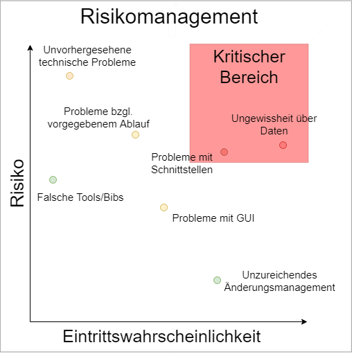

## Risikomanagement

### Identifizierung

Nach einem Brainstorm wurden folgende Risiken erkannt:

- Unwissenheit über die Form/Aussehen/Bestand der zu erhaltenden Daten
- Probleme mit der grafischen Oberfläche
- Probleme mit den Schnittstellen zwischen Backend Modulen bzw. Frontend
- Falsche zeitliche Planung des Ablaufs
- Verwendung von falschen Tools/Bibliotheken
- Unzureichendes Änderungsmanagement sowie plötzlich auftretende Komplikationen, die den zeitlichen Ablauf gefährden

### Gewichtung

Eine Unwissenheit über die Daten, die verarbeitet werden sollen, kann schnell zu vielen Problemen führen, weswegen dieses Risiko am höchsten eingestuft wird.  
Danach folgend wurden Probleme mit den Schnittstellen eingestuft. Das Programm hat viele Module sowie die GUI, die alle miteinander kommunizieren müssen. Sollte dort ein Modul einen output nicht so formatieren können, wie die anderen Module es benötigen, gibt es ein Problem, dass teilweise viel Zeit zum Beheben beansprucht.  
Ein falsch geplanter zeitlicher Ablauf birgt das Risiko, dass alle geplanten Puffer aufgebraucht werden und zum finalen Abgabetermin kein fertiges, laufendes Produkt übergeben werden kann. Da ziemlich bekannt ist, dass Stundenten gerne prokrastinieren, stellen wir dieses Risiko an Stelle 3.  
Unvorhergesehen technische Probleme birgen potentiell sehr hohes Risiko für das Projekt, jedoch ist die Eintrittswahrscheinlichkeit nicht zu gefährlich hoch.  
Eventuell kann es auch Probleme mit der GUI geben, da noch nicht sicher ist, welches Framework benutzt werden soll und wie genau die Darstellung der Daten erfolgt. Zusammen mit den unvorhergesehen technischen Problemen stufen wir diese als mittelschwere Risiken ein.  
Unzureichendes Änderungsmanagement ist relativ wahrscheinlich, jedoch nicht wirklich riskant. Falsche Tools oder Bibliotheken zu verwenden ist relativ unwahrscheinlich, jedoch verherend, sollte es eintreten. Aufgrund von diesen Eigenschaften sind diese Risiken von geringerem Interesse.  

**Gegensteuerungsmaßnahmen:**

Für alle Risiken gilt: In dem Fall, dass ein Problem auftritt, muss mehr Zeit in das Projekt investiert werden. Sei es durch sorgfältigere Planung, schnelle Umsetzung von notwendigen Änderungen, frühzeitige Auseinandersetzung mit Sprache/Tools/Bibliotheken oder Kontakt mit dem Auftraggeber. In bestimmten Fällen, z.B. bei technischen Problemen, kann auch Hilfe von Experten eingeholt werden.
