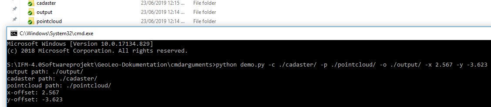

# Benutzerhandbuch

# Vorwort
Das folgende Benutzerhandbuch soll den Umgang mit der Software "GeoLeo" erleichtern. GeoLeo ist ein Produkt, um aus Punktwolken Gebäude zu extrahieren, die mit Hilfe von Katasterdaten identifiziert werden können. Dieses Benutzerhandbuch behandelt dabei, wie GeoLeo zu verwenden ist und soll dem Nutzer Hilfestellungen zu diversen Fragen geben. Dabei wird im Folgenden auf die einzelnen Aspekte und Möglichkeiten eingegangen, die Ihnen mit GeoLeo zur Verfügung stehen. Um sich der angebotenen Inhalte vertraut zu machen, orientieren sie sich bitte am ``Inhaltsverzeichnis`` des Benutzerhandbuchs ``links in der Navigationsleiste``.

Wir wünschen Ihnen viel Freude im Umgang mit GeoLeo!

# Parametrisierte Eingabe


In GeoLeo ist es möglich das Programm ohne Benutzeroberfläche, nur über die Kommandozeile auszuführen. Um trotzdem Einstellungen vornehmen zu können, sollten den Programm beim Starten auf diese Weise Optionen, sogenannte Parameter, mitgegeben werden.

## Auflistung der Parameter

Im Folgenden sind die verschiedenen Parameter und deren Nutzung erklärt.


> **Pfad zu den Katasterdaten:**  
Mit der Nutzung von diesem Parameter, gibt der Nutzer den Pfad (relativ oder absolut) zu einem Ordner an, in dem sich Katasterdaten befinden.  
*Wichtig ist zu erwähnen, dass keine einzelne Datei angegeben wird, sondern ein Ordner, in dem alle sich befindlichen Katasterdaten untersucht werden.*  
```programm -c <Pfad zu Ordner>``` oder ```programm --cadaster <Pfad zu Ordner>```

> **Hilfe:**  
Mit der Nutzung von diesem Parameter, bekommt der Nutzer eine Hilfestellung zur Nutzung der komplizierteren Parameter in GeoLeo.  
```programm -h``` oder ```programm --help```

> **Pfad zum Ausgabeverzeichnis:**  
Mit der Nutzung von diesem Parameter, gibt der Nutzer den Pfad (relativ oder absolut) zu einem Ordner an, in dem die vom Programm erzeugten Punktwolken ausgegeben werden sollen.  
```programm -o <Pfad zu Ordner>``` oder ```programm --output <Pfad zu Ordner>```

> **Pfad zu den Punktwolken:**  
Mit der Nutzung von diesem Parameter, gibt der Nutzer den Pfad (relativ oder absolut) zu einem Ordner an, in dem sich Punktwolken befinden.  
*Wichtig ist zu erwähnen, dass keine einzelne Datei angegeben wird, sondern ein Ordner, in dem alle sich befindlichen Punktwolken untersucht werden.*  
```programm -p <Pfad zu Ordner>``` oder ```programm --pointcloud <Pfad zu Ordner>```

> **Angabe des X-Offsets:**  
Mit der Nutzung von diesem Parameter, kann der Nutzer das Koordinatensystem der Katasterdaten in X-Richtung verschieben, um eine übereinstimmung der beiden Koordinatensystem von Punktwolke und Katasterdaten sicherzustellen.
```programm -x <Offset auf der X-Achse>``` oder ```programm --xoffset <Offset auf der X-Achse>```

> **Angabe des Y-Offsets:**  
Mit der Nutzung von diesem Parameter, kann der Nutzer das Koordinatensystem der Katasterdaten in Y-Richtung verschieben, um eine übereinstimmung der beiden Koordinatensystem von Punktwolke und Katasterdaten sicherzustellen.
```programm -y <Offset auf der Y-Achse>``` oder ```programm --yoffset <Offset auf der Y-Achse>```

> **Versionsnummer des Programms:**  
Unter gewissen Umständen kann es nötig sein, dass der Nutzer die Versionsnummer des Programms angeben soll, z.B. um eine genaue Fehleranalyse oder bessere Unterstützung zu gewährleisten. Mit der Nutzung von diesem Parameter lässt sich die Versionsnummer des Programms ermitteln.  
```programm -v``` oder ```programm --version```


> **Beispiel - Die einzelnen Parameter lassen sich kombinieren:**  
```programm -c ../kadasterdaten/ -p ../punktwolken/ -o ../ausgabeverzeichnis -x -2.5```

## Beispiel

Hier sehen Sie, wie eine getätigte Eingabe in der Konsole aussehen könnte. Wenn die angegebenen Pfade nicht verfügbar sind oder nicht die nötigen Berechtigungen erfüllt sind, würde eine Fehlermeldung ausgegeben.




# Bedienung der GUI

Nach Starten des Programms öffnet sich ein Fenster indem man den Pfad für Las- und Gml-Dateien auswählen soll. Hat man diese ausgewählt kann man zum nächsten Schritt mit `Continue` gehen. Folgend vergrößert sich das Fenster und es ist auf zwei Seiten aufgeteilt. Einmal die Visualisierung der Punktwolken und der Katasterkarten und eine Sidebar mit Funktionen zum Modifizieren der Visualisierung. Die zwei Funktionen, die vorhanden sind, sind das Verschieben und das Skalieren. Bei beiden kann ein Faktor angeben werden, um größere oder kleinere Schritte zu gehen. Liegt die Katasterkarte passend zur Punktwolke kann man auf `Cut Pointcloud` drücken und man kommt zum letzten Fenster. In diesem wählt man ein Pfad aus, in dem die ausgeschnittenen Punktwolken gelagert werden sollen.
